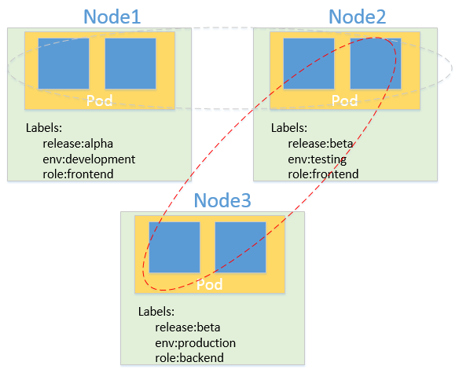

# kubernetes-tutorials

## 介绍
**Production-Grade Container Orchestration**

[Kubernetes](https://kubernetes.io/)（K8s）是用于自动部署，扩展和管理容器化应用程序的开源系统。

* 使用 Docker 对应用程序包装、实例化
* 以集群的方式运行、管理跨机器的容器
* 解决Docker跨机器容器之间的通讯问题
* Kubernetes的自我修复机制使得容器集群总是运行在用户期望的状态

简单来说，Kubernetes 是一个容器管理系统，其中容器在没有特殊情况下即为[Docker](https://www.docker.com/)。同时，Kubernetes 提供了一种规范，可以让你来描述集群的架构，定义服务的最终状态，帮你将系统自动地达到和维持在这个状态。

## 基本概念及组件
### Cluster - 集群
集群是一组**节点**，可以是物理机或虚拟机，<del>甚至可以是容器</del>。节点的角色分为**Master**和**Node**，Master 负责整个集群的管理和控制，Node 负责运行容器应用。开发测试环境中 Master 和 Node 可以部署在相同节点（个人学习可以使用 [minikube](https://kubernetes.io/docs/tasks/tools/install-minikube/)），生产环境则应分开部署。

### Container - 容器
容器是Kubernetes集群中的低级别组件，在上面运行着具体的应用进程。

[More...](./components/docker.md)

### Pod
Pod 是 Kubernetes 最基本的部署调度单元。每个 Pod 由一个或多个业务容器和一个根容器（Pause容器）组成，同一个 Pod 内的容器共享网络命名空间和文件系统，容器间可以通过 localhost 通信。通常，一个Pod表示某个应用的一个实例。

[More...](./components/pod.md)

### Label
Label 是一个 key-value 键值对，可以附加到各种资源对象上，一个资源对象可以定义任意数量的 Label。

### Service
Service 是 Kubernetes 最重要的资源对象之一。Kubernetes 中的 Service 对象可以对应微服务架构中的微服务。Service 定义了服务的访问入口，服务的调用者通过这个地址访问 Service 后端的 Pod 副本实例。Service 通过 Label Selector 同后端的 Pod 副本建立关系，Deployment 保证后端Pod 副本的数量，也就是保证服务的伸缩性。

[More...](/.components/service.md)

### Node
Node 也可称为 Worker，是 Kubernetes 集群中的工作节点，主要包含如下组件：

* kubelet：负责 Pod 的创建、启动、监控、重启、销毁等工作，同时与 Master 节点协作，实现集群管理的基本功能。
* kube-proxy：实现 Kubernetes Service之间的通信和负载均衡
*  docker：docker 容器引擎，负责容器的创建和管理

### Master
Master 是 Kubernetes 集群中的控制节点，主要包含如下组件：

* kube-apiserver：集群控制的入口，提供 HTTP REST 服务，所有资源增删改查的唯一途径
* kube-controller-manager：Kubernetes 集群中所有资源对象的自动化控制中心，当有资源没达到预期状态，则由对应的 controller-manager 自动修复
* kube-scheduler：主要负责将 Pod 调度到最合适的 Node

[More...](./components/node.md)

### Namespace
Namespace（命名空间）是在多个用户之间划分集群资源的一种方法，是底层依赖于同一个物理集群的虚拟集群。

### Etcd
Etcd是一个分布式的 key-value 存储，作为保存整个集群状态的数据库。

## 组件间通信
一个最典型的创建Pod的流程如下：

* 用户通过 kube-apiserver 提供的 REST API 创建一个 Pod
* kube-apiserver 将数据写入 etcd
* kube-scheduler 检测到未绑定 Node 的 Pod，开始调度并更新 Pod 的 Node 绑定
* kubelet 检测到有新的 Pod 调度过来，通过 container runtime 运行该 Pod
* kubelet 通过 container runtime 取到 Pod 状态，并更新到 apiserver 中

