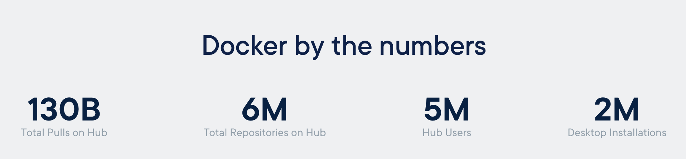
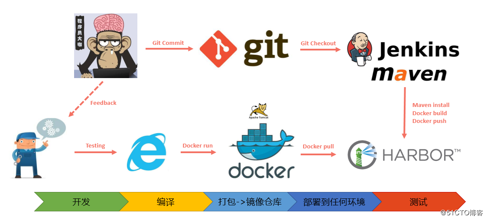
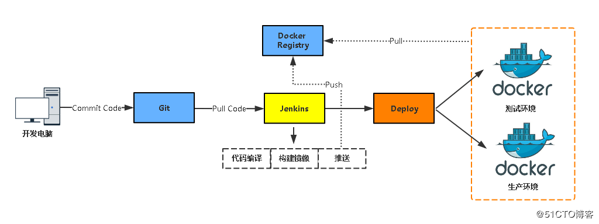

<!--
 * @Author: howardhh
 * @Date: 2020-05-22 08:42:09
 * @LastEditTime: 2020-05-25 13:46:51
 * @LastEditors: Please set LastEditors
 * @Description: Docker Learning
 * @FilePath: \kubernetes-tutorials\components\docker.md
--> 

# Docker

* Docker 是什么（Introduction)
* Docker 怎样上手（Get started)
* Docker 是否适合我（Who should use）

[zz:举个例子](https://www.zhihu.com/question/48174633/answer/229253704)


[zz:再举个例子](https://www.zhihu.com/question/28300645/answer/67707287)
我来到一片空地，想建个房子，于是我搬石头、砍木头、画图纸，一顿操作，终于把这个房子盖好了。


结果，我住了一段时间，想搬到另一片空地去。这时候，按以往的办法，我只能再次搬石头、砍木头、画图纸、盖房子。
但是，跑来一个老巫婆，教会我一种魔法。
这种魔法，可以把我盖好的房子复制一份，做成“镜像”，放在我的背包里。


我到了另一片空地，就用这个“镜像”，复制一套房子，摆在那边，拎包入住。


## 概述
Docker 是一个基于 Go 语言开发的开源容器引擎，可以让你将应用与基础设施分开，从而快速的部署到其他环境。
Docker 解决了一个世界级难题：<b>为啥在我这跑的好好的，到你那就不行</b>？

网络大哥偷偷在旁边<code>ping</code>和<code>telnet</code>...



Docker 的使用已经非常普遍，特别是在各大互联网公司中，京东618，天猫双11背后都有数十万的容器支撑。

### 容器
Docker 是容器的一种更高级的实现方式，也可以说是容器的代名词，它的前身是 LXC（Linux Container），诞生于2008年。
LXC 是一种内核轻量级的操作系统层虚拟化技术，可以提供比传统虚拟化更轻量级的虚拟化，主要基于 [Namespace](https://www.man7.org/linux/man-pages/man7/namespaces.7.html) 和 [Cgroup](https://www.man7.org/linux/man-pages/man7/cgroups.7.html) 两大机制。

 

其他容器技术：[CoreOS RKT](https://coreos.com/blog/rkt)

### Docker 架构
Docker 引擎是一个 C/S 架构的应用，包含如下主要组件：

* 服务端，运行在操作系统中的守护进程（<code>dockerd</code>）
* REST API，提供客户端操作服务端的接口
* 客户端，命令行工具（<code>docker</code>）


### Docker 重要组件
* The Docker daemon
* The Docker client
* Docker objects
  * IMAGES：镜像是用来创建容器的只读模板，通常是基于另外一个镜像，并添加一些自定义的内容。比如，一个镜像可以包含一个完整的 centos 操作系统，里面安装 apache 和用户的应用，以及一些配置参数来使容器运行。用户既可以自己创建镜像，也可以直接从其他人那里下载一个已经做好的镜像来直接使用。[DockerHub](https://hub.docker.com/)
  * CONTAINERS：容器是从镜像创建的运行实例，它可以被启动，开始、停止、删除、每个容器都是互相隔离的，保证安全的平台，可以把容器看做是一个简易版的linux环境（包括root用户权限、镜像空间、用户空间和网络空间等）和运行在其中的应用程序。
* Docker registry：镜像仓库是集中存储镜像的地方，分为公共仓库和私有仓库。
  


### Docker 解决的问题
<!--* 快速、持续的交付应用
* 响应式的部署和扩展
* 在相同硬件上运行更多负载-->

开发：代码在我机器上跑得好好的，为啥到别人机器上就跪了？<b>一次构建，到处运行</b>。
运维：用最少的机器跑最多的应用，又给公司省了钱，美滋滋。<b>提高利用率，节约成本</b>
公司：Docker！ 微服务！ DevOps！ K8S！ 整！<b>整合能力，提升效率，优化架构</b> 

容器的本质是<b>基于镜像的跨环境迁移</b>。


## 实战

### 安装

* [Mac](https://docs.docker.com/docker-for-mac/install/) or [Windows](https://docs.docker.com/docker-for-windows/install/)：下载 Docker Desktop
* [Linux](https://docs.docker.com/engine/install/binaries/)：通过不同发行版系统的软件源（<code>yum</code> / <code>apt-get</code>）或二进制包安装。证通开发测试环境[前往](http://11.8.38.55:9080/kubernetes/docker/)安装。

### 镜像操作
```bash
docker image      # 查看可执行命令
docker pull       # 拉取镜像
docker push       # 推送镜像
docker build      # 构建镜像
docker image ls   # 列出镜像
```

### 容器操作
```bash
docker container  # 查看可执行命令
docker run        # 运行容器
docker logs       # 查看容器日志
docker exec       # 在容器内执行命令
```

> Tips： Docker 容器基本不支持<code>ssh</code>操作，尽量避免直接修改已启动容器的配置。

> Hands on：快速启动一个 [Redis](https://hub.docker.com/_/redis) 实例

### 构建应用镜像
Docker 使用<code>Dockerfile</code>构建镜像。


> Hands on：基于 [tomcat](https://hub.docker.com/_/tomcat?tab=description) 镜像构建一个 java 应用.

[进阶篇](./dockermore.md)

### 容器编排
目前的容器编排三大工具：
* Docker-Compose：Docker 提供的一个命令行工具，用来定义和运行多个容器组成的应用程序。仅能管理当前主机上的 Docker。
* Docker Swarm：Docker 公司自研的用来管理多主机上 Docker 容器的工具。
* Kubernetes（K8S）：定位与 Docker Swarm 类似，已成为容器编排领域的领导者。

> Hands on：在刚才 tomcat 应用的基础上增加一个 [nginx](https://hub.docker.com/_/nginx) 并使用<code>docker-compose</code>进行编排。

[Sugar-Kubernetes 自服务演示](http://11.8.38.55:9080/kubernetes/srvindex/)

[Portainer 演示](http://11.8.84.11:39000)

[无认证镜像仓库演示](http://11.8.84.11:8080)

[认证镜像仓库演示](https://11.8.84.11:28443)

[Rancher 演示](https://11.8.84.11:8443)

### CI/CD




## 使用场景

### 实际应用
大数据 IPO 项目、开发测试数据库，智能科技 K8S 集群部署，Sugar 自动化平台，阿里云平台内部

### 适合
* 多环境开发：Mac, Windows, Linux
* 多环境迁移：开发，测试，生产（ydt/ysi/ymt/ypt/ypm/ypd）
* 多业务模块（微服务），需要隔离
* 频繁迭代
* 标准化交付
* 无状态应用

### 不适合
* 程序与内核或驱动有较多交互（路由、LVS等网络程序）
* 数据量大，需要持久化的数据库

