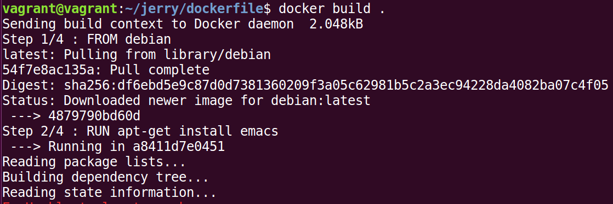
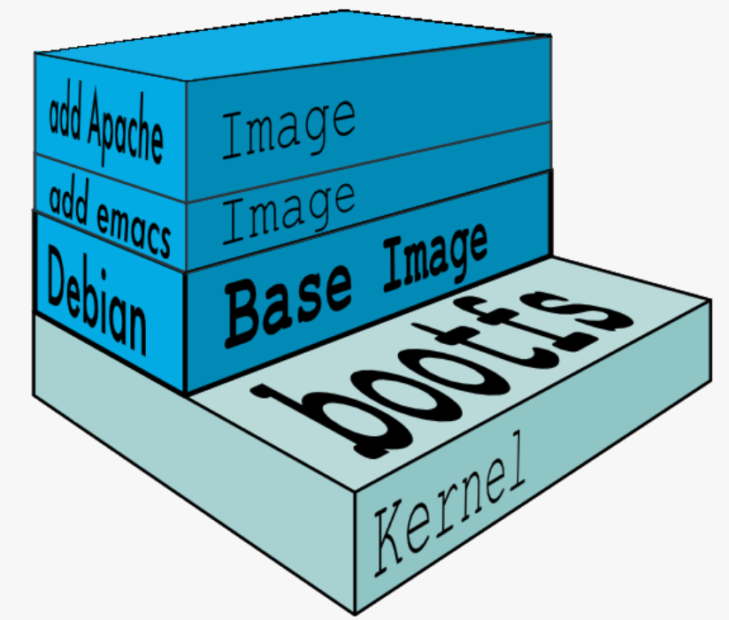
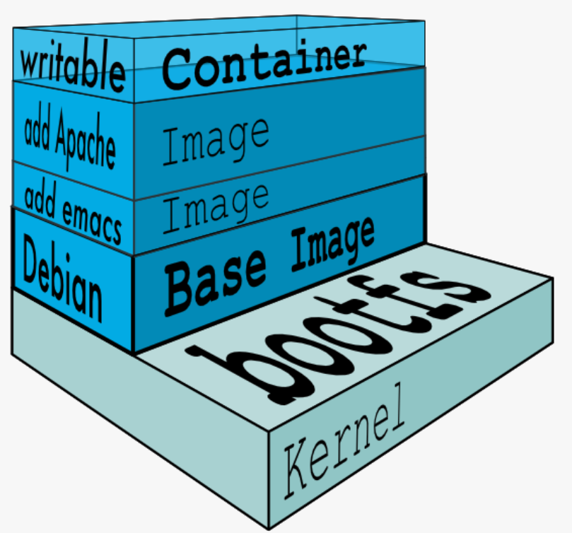
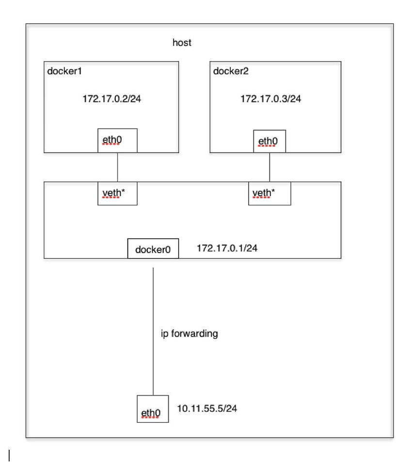

## Docker 镜像分层技术
镜像是 Docker 最重要的概念，也是最突出的一个创新，可以将看作是一个特殊的文件系统，除了提供容器运行时所需的程序、库、资源、配置等文件外，还包含了一些为运行时准备的一些配置参数（如匿名卷、环境变量、用户等）。镜像不包含任何动态数据，其内容在构建之后也不会被改变。

镜像由一些只读的镜像层（Layer）组成，Docker 则通过 UnionFS 将这些镜像层组合在一起，Dockerfile 的每一个指令都会在基础镜像上增加一层。
> UnionFS（联合文件系统）可以把多个目录内容联合挂载到同一个目录下，而目录的物理位置是分开的。

```
FROM debian
RUN apt-get install emacs
RUN apt-get install apache2
CMD ["/bin/bash"]
```
执行命令 `docker built .` 的结果：



使用<code>docker run</code>启动容器时，实际上是在源镜像上添加了一个新的可写层，也叫容器层，容器启动后，其内应用的所有改动都发生在这个新建的可写层，对下面的只读镜像层没有任何影响。




> Copy-on-Write：写时复制技术；当要对只读层中的文件作出改动时，文件会先被复制到可写层，改动仅会作用于可写层中的文件。

## Docker 网络基本原理

容器网络方案可以分为三部分：
* 单机的容器间通信
* 容器与主机间通信
* 跨主机容器间通信

介绍下单机下的 Docker 网络通信模式。

Docker 支持四种网络模式：bridge 桥接模式、host 宿主机模式、container join容器模式、none 模式，可以使用<code>--network</code>参数指定，默认是 bridge 模式。

### bridge 模式

namespace 是 Linux 内核用来隔离内核资源的方式。network namespace 隔离了网络设备、网络栈、端口等资源，不同 network namespace 中的设备无法直接通信。

Linux Bridge（网桥）是一个虚拟网络设备，用来做二层协议交换，与交换机功能相似。

veth 即虚拟以太网卡（Virtual Ethernet)，veth 设备总是成对的，因此称为 veth pair。veth pair 一端发送的数据会在另一端被接收，常被用于跨 network namespace 之间的通信。

Docker 在安装时会默认创建一个名为 docker0 的 Linux 网桥，在不指定<code>-net</code>参数时，Docker 为每个容器分配一个 network namespace，设置一个 IP，将容器的 veth pair 的一端连接到 docker0 网桥。默认情况下，docker0 的 IP 地址为 172.17.0.1，连接到 docker0 上的容器的 IP 地址范围是 172.17.0.0/24，默认网关为 docker0 的地址，即同主机上的容器处于同一网段，借助 docker0 网桥实现了通信。



### host 模式

使用<code>--netwok=host</code>参数可以在容器启动时将其连接到宿主机网络，此时容器的网络配置和宿主机完全一样，容器不会有独立的 network namespace，不会连接到 docker0 网桥，没有虚拟网卡和 IP，而是使用宿主机的 IP 和端口。

> 优点：没有性能损耗、配置方便；缺点：隔离性不好，与宿主机争抢资源。

### container 模式

使用<code>--network=container:NAME_or_ID</code>可以在创建新容器时让其和一个已经存在的容器共享 network namespace，但新容器没有网卡、IP、路由等信息，需要额外手动配置，两个容器可以通过 lo 网卡通信，即使用<code>localhost</code>通信。

> Kubernetes 的 Pod 网络采用的就是 container 模式。

### none 模式

使用<code>--network=none</code>配置，该模式下容器有自己的 network namespace，没有其他的网络配置，需要自己添加，自由度高。

### 常用技巧
* 端口映射：比如，通过<code>-p 10080:80</code>参数可以将宿主机 10080 端口映射到容器的 80 端口，从而对外提供服务。原理就是在宿主机的 iptable 的 nat 表中添加一条规则，将访问宿主机 IP地址:端口 的数据包进行一次 DNAT，转换成 容器IP:容器端口。
* 访问外网：从容器内访问外网一般涉及两个因素：ip_forward 和 SNAT/MASQUERADE。默认情况下，容器连接到 docker0 网桥，借助 Linux 系统的转发功能访问外网，如果发现不能访问，需要确认一下几点：
  * 宿主机系统的 ip_forward 是否打开（ sysctl net.ipv4.ip_forward=1 ）
  * Docker 启动时 --ip-forward 参数是不是被设置成 false 了（一般不会）

  SNAT/MASQUERADE 即在 iptables 的 POSTROUTING 链上创建一条规则，将从容器网段出来访问外网的包做一次 MASQUERADE，将出去的包源地址替换成宿主机 IP 地址。
* docker link：通过参数<code>--link container1:alias1</code>将新创建的容器与 container1 点对点连接起来，使两个容器间可以使用容器名通信，而不依赖 IP 地址。

