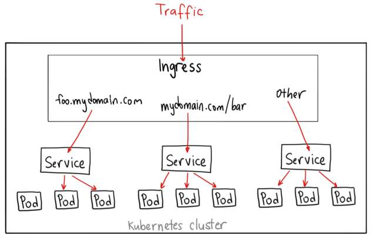

## 为什么要用Kubernetes

物理机：最开始，应用被部署在物理机上，但由于物理机无法很好的隔离资源，使得不同的应用需要部署在不同的主机，这又导致了资源的巨大浪费。

虚拟机：多个虚拟机可以被部署在同一台物理机上，这样解决了资源隔离的问题，提高了硬件设备的利用率，但每一台虚拟机又包含了完整的操作系统和其他必要组件，使其启动速度未得到明显改善，同时，操作系统也会占用大量的硬盘资源。

容器：

*  容器镜像的创建简单，易于回滚
*  分离应用程序与基础架构
*  不同环境的一致性与可移植性
*  以应用程序为中心的管理
*  松耦合、分布式与微服务
*  资源隔离与资源利用

Kubernetes：

* 服务发现与负载均衡：可以使用 DNS 名称或 IP 地址发布服务，服务自动负载到后端 Pod 的流量。
* 自动部署和回滚：通过资源文件描述所需状态，Kubernetes 将以可控的速率进行更新。
* 自我修复和自动伸缩：自动重启、替换状态异常的容器，基于不同指标自动扩缩 Pod 数量。
* 密钥与配置管理：敏感信息单独保存，可以在不重建容器镜像的情况下更新配置。

## 服务发现、负载均衡、服务暴露
这些都基于 Kubernetes 最核心的资源对象 - **Service**。

Kubernetes 中，由于 Pod 的生命周期有限，重启或销毁时其 IP 地址会发生变化，Kubernetes 为我们提供了一个对象： Service。

Service 是一种抽象的对象，定义了一组 Pod 的逻辑集合和一个访问策略。Service 有固定的 IP 和端口，通过 Labels 自动关联后端的 Pod，Kubernetes 内部维护这些关联关系，用户则无需关心访问到哪个后端 Pod。

```yaml
apiVersion: v1             # 资源对应的接口版本
kind: Service              # 资源类型
metadata:                  # 元数据
  name: myservice
spec:
  selector:                # 后端 Pod 标签选择器
    app: myapp
  ports:                   # Service 端口
  - protocol: TCP
    port: 80
    targetPort: 8080
    name: myapp-port
  type: ClusterIP/NodePort/LoadBalancer   # 服务访问类型
```

### 服务发现
传统架构中，一般通过固定 IP 地址或 Consul、ZooKeeper 等工具实现服务发现，而 Kubernetes 支持两种服务发现方式：环境变量和 DNS。
#### 环境变量
创建 Pod 时，Kubernetes 会将每个活跃的 Service 的相关环境变量写入到 Pod。
```bash
REDIS_SERVICE_HOST=10.100.100.100
REDIS_SERVICE_PORT=8080
```
这种方式缺点很明显：
* 服务需要先运行起来才能被发现
* 服务故障或绑定新地址后不会自动修改 Pod 中的环境变量

#### DNS
> Kubernetes 目前默认使用 CoreDNS 插件提供 DNS 服务。
Kubernetes 通过修改每个 Pod 中容器的<code>/etc/resolv.conf</code>文件来达到服务发现的目的。
```bash
nameserver 179.10.0.2
search rook-ceph.svc.cluster.local svc.cluster.local cluster.local dev-k8cluster01.service.sugar
options ndots:5
```
DNS 服务器会监听集群所有 Service API，以在服务变更时修改记录。

### 负载均衡
Kubernetes 通过其核心组件 kube-proxy 实现从 Service 到 Pod 的流量转发及负载均衡。

kube-proxy 运行在每个 Node 节点，默认使用 iptables 模式，它会定时从 etcd 获取 service 信息来设置相应的转发策略和四层负载均衡。

### 服务暴露
Service 目前常用的服务暴露方式有三种：
* ClusterIP：默认的方式，用于在集群内部访问。
* NodePort：通过绑定宿主机端口对集群外提供服务。
* LoadBalancer: 公有云上使用。

除了以上原生的方式，Kubernetes 还提供了另外一种与其他软件结合的方式：Ingress。

Ingress 就是从集群外访问的一个入口，将外部请求转发到集群内的 Service 上，相当于 nginx、haproxy 等代理服务器。但直接使用 nginx 又不便于管理，就又需要 consul 等服务发现工具（这种方式已经在单纯的 docker 环境中普遍使用）。

Ingress 正是集成了上面的功能。Ingress Controller 是集群中需要额外启动的一个服务，其封装了一个负载均衡器，通过和 apiserver 通信实现动态感知 Ingress 定义的规则并生成负载均衡器的配置文件。常用的 Ingress Controller 有 traefik、nginx-controller、haproxy-controller等。

> Ingress 定义规则，Ingress Controller 监听信息并更新配置，Ingress Controller 服务绑定在宿主机固定端口。

```yaml
apiVersion: networking.k8s.io/v1beta1
kind: Ingress
metadata:
  name: simple-example
  annotations:
    kubernetes.io/ingress.class: traefik           # 使用 traefik-controller
spec:
  rules:                                           # 域名转发规则
  - host: traefik.ect888.com
    http:
      paths:
      - backend:
          serviceName: traefik-ingress-service     # 域名对应的后端服务
          servicePort: 8080
```



## 如何保证服务可用性
### 控制器
控制器通过 apiserver 监控集群的状态，并致力于将当期状态转变为期望的状态。

副本控制器确保在任何时候都有特定数量的 Pod 副本处于运行状态。当 Pod 被删除、异常终止或中断性维护之后，副本控制器会重新创建，那么即使程序中只有一个 Pod，也应该使用副本控制器创建。副本控制器包括 RelicaSet/ReplicationController/Deployments/StatefulSets/DaemonSet等。

应用程序常用的有两种：

#### Deployments
常用于创建无状态应用，可以看成是升级版的 ReplicationController。主要功能包括：确保 Pod 数量、确保 Pod 健康、弹性伸缩、滚动升级、事件和状态查看、回滚、版本记录、暂停和启动。

```yaml
apiVersion: apps/v1          # 资源对应的接口版本
kind: Deployment             # 资源类型
metadata:                    # 资源元数据
  name: nginx-deployment     ## deployment名称
  lables:                    ## deployment标签
    app: nginx
spec:                        # 期望资源达到的状态
  replicas: 3                ## 期望的pod副本数量
  selector:                  ## deployment选择的pod标签
    matchLabels:
      app: nginx
  template:                  ## pod资源模板，即pod的配置参数
    metadata:                ### pod的元数据
      labels:                ### pod的标签
        app: nginx
    spec:                    ### 期望每个pod达到的状态
      containers:            #### pod内的容器
      - name: nginx
        image: nginx:1.14.2
        ports:
        - containerPort: 80

# status                       资源实际的状态
```

如下图，一个 Deployment 拥有多个 ReplicaSet，一个 ReplicaSet 拥有一个或多个 Pod。Deployment 通过控制多个 ReplicaSet 实现回滚机制，每当有变更时，Kubernetes 会重新生成一个 ReplicaSet 并保留，用于回滚到之前的状态。
  


#### StatefulSets
用于创建有状态应用。StatefulSet为它所管理的 Pod 提供**序号和唯一性保证**。StatefulSet 适用于需要满足以下需求的应用程序：

* 稳定的、唯一的网络标识符（比如 hostname）
* 稳定的、持久的存储
* 有序的、优雅的部署和缩放
* 有序的、自动的滚动更新

## 数据持久化
* Volumes：在 Docker 容器和 Kubernetes 中都有数据卷的概念，
* Persistent Volumes（PV）：PV 是对底层共享存储的一种抽象，由管理员创建和配置，常用的底层共享存储技术有Ceph、GlusterFS、NFS等，通过插件进行对接。
* PersistentVolumeClaims（PVC）：PVC 是用户存储的一种声明，与 Pod 比较类似，Pod 消耗节点资源，PVC 消耗 PV 资源。PVC 可以请求特定的存储空间和访问方式，用户无需关注底层存储细节，直接使用 PVC 即可。
* Storage Class：

## 怎样排查问题（查看日志）
传统应用通常会将日志写入本地文件，而容器化应用一般将日志写入到<code>stdout</code>和<code>stderr</code>，容器默认会将日志输出到宿主机的一个 json 文件并通过<code>docker logs</code>命令查看。

但是，如果容器崩溃、被删除或节点故障时，原来的方式将无法继续访问日志，所以应将日志独立于节点或容器的生命周期。

Kubernetes 本身不提供日志收集的解决方案，一般来说主要有以下三种：
* 在宿主机节点上运行一个 agent 收集日志：比如将 Fluentd 使用 DaemonSet 控制器以守护进程的方式部署在每个节点，并将节点上的所有容器日志推送到统一的后端，但该方法仅适用于收集输出到<code>stdout</code>和<code>stderr</code>的日志。


* 使用 sidecar 容器收集日志： 如果应用程序的日志是输出到某个日志文件，上面的方法显然行不通，此时可以在 Pod 中另外启动一个 sidecar 容器将日志重定向到<code>stdout</code>，或是直接使用一个日志采集代理（比如 filebeat）将日志直接推送到后端。


* 在应用程序的代码中直接将日志推送到后端。
  


上面三种方法各有利弊，agent 方式采集范围有限，sidecar 方式消耗大量资源，应用程序方式需要修改应用程序代码，应该对症下药。
> 日志的后端程序多使用 Elasticsearch + Kibana。

## 怎样实现持续发布
目前主要的方式有如下两种：

### Jenkins

* 开发人员提交代码到 Gitlab
* 通过 Gitlab 配置的 Jenkins Webhook 触发 Pipeline 自动构建
* Jenkins 触发构建任务，执行 Pipeline 脚本中定义的步骤（单元测试 - Maven 构建 - 构建镜像 - 推送镜像）
* 触发 Kubernetes 更新服务

Jenkins 内部集成了 Kubernetes 插件，服务端通过与部署在 Kubernetes 集群中的 Jenkins 客户端通信实现以上功能。

### Gitlab CI


* Gitlab Runner：在 Kubernetes 集群中安装 runner 与 Gitlab 服务端通信
* Kubernetes Executor：runner 的插件，用于与 Kubernetes 集群通信
* .gitlab-ci.yml 位于 git 项目根目录的一个文件，记录了 pipeline 的阶段和执行规则