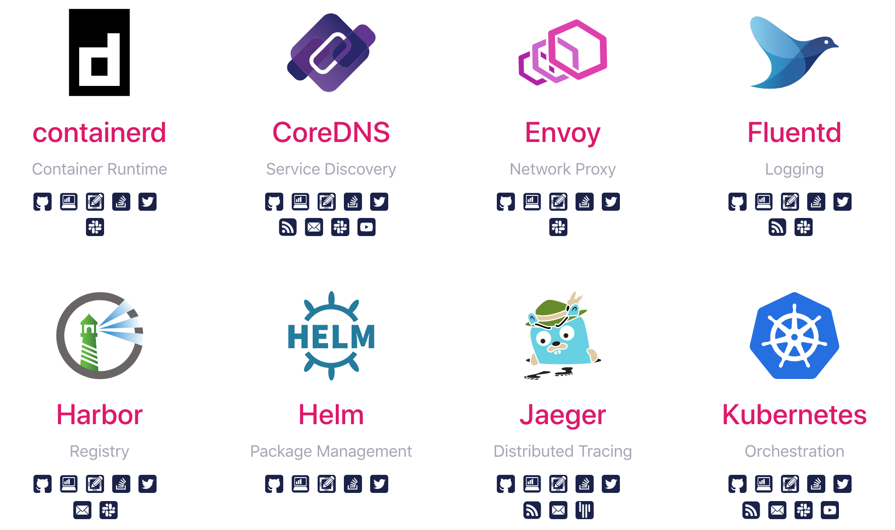

# 云原生与基于 Kubernetes 的应用发布

## 回顾

### Docker
* 镜像：用来创建容器的只读模板，通常是基于另外一个镜像，并添加一些自定义的内容。
* 容器：容器是从镜像创建的运行实例，它可以被启动，开始、停止、删除、每个容器都是互相隔离的，保证安全的平台，可以把容器看做是一个简易版的linux环境（包括root用户权限、镜像空间、用户空间和网络空间等）和运行在其中的应用程序。
* 镜像仓库：镜像仓库是集中存储镜像的地方，分为公共仓库和私有仓库。
  http://11.8.38.55:9080/kubernetes/docker/


<br><br>

## 云原生
云原生是一种行为方式和设计理念，凡是能够提高云上资源利用率和应用交付效率的行为或方式都是云原生的。




云原生代表技术包括：**容器、微服务、服务网格、不可变基础设施和声明式API**。<!-- kubernetes项目编排能力的核心 -->

* 不可变基础设施：创建后不能改变。解决环境间差异问题/快速回滚到老版本/更好的进行CI/更好的自动化/更容易进行大规模运维
* 声明式API：提交一个定义好的 API 对象来"声明"我所期望的状态。
<!-- 我要
　　这铁棒有何用
　　我有
　　这变化又如何
　　还是不安
　　还是氐惆
　　金箍当头
　　欲说还休 -->
<br><br>
### 云原生要素：选自( Twelve-Factor App )
* 基线代码 - Codebase：一个项目一个仓库，把通用的代码抽成独立维护的仓库。<!-- 反模式的例子：多个不相干项目数百万行代码全部放到一个代码仓库；对于一些需求差异，直接复制项目仓库单独开发，同时维护多个仓库代码。想象一下这两个例子，CI/CD系统心理阴影面积多大。-->
* 显式和隔离的依赖 - Dependencies：完善的依赖管理机制、显式的依赖声明文件和版本锁机制，能够减少因为错误的依赖版本导致的Bug。<!-- 反模式的例子：Node.js之父Ryan Dahl另起炉灶创造了Deno，Deno的import远程代码就是Node世界的npm反向极端，造成了隐式依赖；Golang在1.13之前没有go module的时候，也是违反这条原则的。且不说不清晰的第三方依赖容易导致“投毒”，这对代码的问题定位、维护、交接都是很大的负担。-->
* 配置分离存储到环境中 - Configuration：配置数据和构建产物完全分离，配置数据单独管理，只在运行环境中出现。<!-- 反模式的例子：环境相关的配置，混在容器镜像、甚至代码包中，每个环境需要单独构建打包一个版本。这种“不正确”的做法在传统的开发模式中很常见。-->
* 环境对等 - Dev/Prod Parity：最大限度减少“我本地是正常的啊”、“开发环境是正常的啊”、“是不是环境/机器问题”<!-- 反模式的例子：开发环境不容器化，产线容器化；开发环境用的MariaDB，产线用的MySQL；开发环境数据库没主从，产线配置了主从同步。这样在MySQL读写分离时，主从同步那几毫秒的延迟导致各种奇怪Bug，在开发环境也许永远都重现不出来。--> 
* 分离基础的后端组件 - Backing services：所有依赖的基础组件或者其他应用服务，比如数据库、缓存服务、消息队列、二方/三方服务，都视为外部资源，独立部署，通过网络访问。<!-- 反模式的例子：把缓存服务和应用服务打包到同一个容器镜像，通过/var/redis.sock这样的Domain Socket形式访问；或者把第二方应用服务的源码直接复制到自己的代码中，在一个进程中互相调用。-->
* 无状态的服务进程 - Processes：应用实例之间不互相通信，不共享内存数据<!-- 反模式的例子：应用服务的多个实例之间互相通信，共享一些内存数据；或者开发自治的集群选主、任务分发等功能。-->
* 易处置 - Disposability：快速启动和优雅退出，随时可能被创建或销毁的服务实例 <!-- 不具有快速启动能力，水平扩容的速度受限；不具备优雅退出能力，缩容时未处理完的业务中断，会导致用户请求错误、数据不一致性等问题。-->
* 日志作为事件流 - Logs：应用服务不应该管日志怎么处理 <!-- log4xx的复杂配置，日志文件存哪个路径、多长时间轮滚、保留多久删除，直接输出到 stdout,stderr -->
* 分离管理类任务 - Admin Processes：比如DBA执行SQL，运维执行定时脚本 <!-- HTTP/RPC接口，Kubernetes CronJob -->


Kubernetes 作为云原生应用的基石，相当于一个云操作系统，其重要性不言而喻。如果想构建云原生架构，建议直接从 Kubernetes 入手即可。

<!--
一个典型的容器化后端服务，从开发到上线需要经历哪些步骤：
1. 设计阶段：需求分析和领域设计、技术选型确定依赖的框架和组件、建立项目框架
2. 开发阶段：开发、测试、代码评审，迭代到可发布的版本
3. 创建镜像仓库，为服务编写Dockerfile，构建出服务的容器镜像
4. 创建容器编排文件，确定非生产环境部署阶段的各项细节（资源，数据保存，副本数）
5. 在测试环境确认基础设施容量以及第三方组件，符合条件并初始化完毕，比如数据库的创建和初始化DDL的执行
6. 准备部署到测试环境，在配置中心创建或更新配置文件，配置参数和密钥等
7. 创建或更新持续集成、交付系统的任务管道， 执行CI/CD Pipeline，部署到测试环境
8. 配置测试环境的访问入口，如反向代理的路由、域名等等
9. 日志、监控、告警、链路追踪等相关组件接入
10. 在测试环境进行完整的功能集成测试、性能测试
11. 在预上线环境，重复步骤6-10
12. 在产线环境，重复步骤6-10
13. 继续迭代，完成开发和单测后，在每个环境重复步骤6-10，其中7,8,9中无需修改的部分可以跳过
14. 每次迭代灰度发布，逐步放开新版本的流量
-->
<br><br>
### [Kubernetes](https://kubernetes.io/zh/)
Kubernetes（K8s）是用于自动部署，扩展和管理容器化应用程序的开源系统。

* 使用 Docker 对应用程序包装、实例化
* 以集群的方式运行、管理跨机器的容器
* 解决Docker跨机器容器之间的通讯问题
* Kubernetes的自我修复机制使得容器集群总是运行在用户期望的状态

Kubernetes 是一个容器管理系统，其中容器在没有特殊情况下即为Docker。同时，Kubernetes 提供了一种规范，可以让你来描述集群的架构，定义服务的最终状态，帮你将系统自动地达到和维持在这个状态。

* [Pod](https://kubernetes.io/zh/docs/concepts/workloads/pods/): Kubernetes 最基本的部署调度单元。每个 Pod 由一个或多个业务容器和一个根容器（Pause容器）组成，同一个 Pod 内的容器共享网络命名空间和文件系统，容器间可以通过 localhost 通信。通常，一个Pod表示某个应用的一个实例。
* [Service](https://kubernetes.io/zh/docs/concepts/services-networking/service/): Service 定义了服务的访问入口，服务的调用者通过这个地址访问 Service 后端的 Pod 副本实例。Service 通过 Label Selector 同后端的 Pod 副本建立关系。
  


* [Deployment](https://kubernetes.io/zh/docs/concepts/workloads/controllers/deployment/)：副本控制器，为 Pods 和 ReplicaSets 提供声明式的更新能力。保证后端 Pod 副本的数量和服务的伸缩性。
  

  
  * 创建 Deployment 以将 ReplicaSet 上线。 ReplicaSet 在后台创建 Pods。 检查 ReplicaSet 的上线状态，查看其是否成功。
  * 通过更新 Deployment 的 PodTemplateSpec，声明 Pod 的新状态 。 新的 ReplicaSet 会被创建，Deployment 以受控速率将 Pod 从旧 ReplicaSet 迁移到新 ReplicaSet。 每个新的 ReplicaSet 都会更新 Deployment 的修订版本。
  * 如果 Deployment 的当前状态不稳定，回滚到较早的 Deployment 版本。 每次回滚都会更新 Deployment 的修订版本。
  * 扩大 Deployment 规模以承担更多负载。
  * 暂停 Deployment 以应用对 PodTemplateSpec 所作的多项修改， 然后恢复其执行以启动新的上线版本。
  * 使用 Deployment 状态 来判定上线过程是否出现停滞。
  * 清理较旧的不再需要的 ReplicaSet。

```yaml
apiVersion: apps/v1
kind: Deployment
metadata:
  name: nginx-deployment
  labels:
    app: nginx
spec:
  replicas: 3
  selector:
    matchLabels:
      app: nginx
  template:
    metadata:
      labels:
        app: nginx
    spec:
      containers:
      - name: nginx
        image: nginx:1.14.2
        ports:
        - containerPort: 80
```
<br><br>

<!-- 开发只需关心deployment，不需要关心其他 -->

## 应用发布

### 停机发布( **Recreate** )
或者叫做直接替换部署，一般应用于服务器需求较少的业务，优点是降低资源成本，部署方便；缺点是业务需要停止服务，如某些证券公司在不开盘的时候都会停服维护。

Kubernetes提供的两种策略之一。停止所有运行的旧版本实例，再重新创建新版本实例。
```yaml
spec:
  strategy:
    type: Recreate
```
<br><br>

### 滚动发布( **RollingUpdate** )
在升级过程中，并不一下子启动所有新版本，是先启动一台新版本，再停止一台老版本，然后再启动一台新版本，再停止一台老版本，直到升级完成。

优点是可以保持 0 downtime ，实现了不停服更新，比较节省资源。缺点是在一段时间内，线上运行两个不同版本，出现问题时，无法保证一个稳定的线上环境。


**RollingUpdate** 是 Kubernetes 默认的发布策略，更新时，Deployment 会创建一个新的 ReplicaSet，并逐渐在新 ReplicaSet 中添加新版本 Pod 实例，减少旧 ReplicaSet 中的 旧版本 Pod 实例，直到完成所有副本完成升级。

```yaml
spec:
  strategy:
    type: RollingUpdate
    rollingUpdate:
      maxSurge: 2       # 最大超出期望 Pod 个数上限，默认为25%
      maxUnavailable: 0 # 最大不可用 Pod 个数上限，默认为25%
```
<br><br>

### 蓝绿发布
蓝色环境指当前正在使用的生产环境，绿色环境指将要发布新版本的环境（热备环境），通过在两个生产环境中切换流量来实现应用版本的更新。应用更新时，蓝色环境仍然对外提供服务，绿色环境升级应用版本，测试通过后，通过负载均衡变更，将流量指向绿色环境。


优点是操作简单，可以在绿色环境下充分测试，回滚速度快。缺点是成本高。

蓝绿发布与 Kubernetes 中 Deployment 的更新策略无关，可以依靠更新 Service 切换流量到不同版本 Pod 实例来实现，或使用第三方部署插件实现自动化。适合使用 Kubernetes 实现。
<br><br>

### 灰度发布
灰度发布也叫金丝雀发布，起源是，矿井工人发现，金丝雀对瓦斯气体很敏感，矿工会在下井之前，先放一只金丝雀到井中，如果金丝雀不叫了，就代表瓦斯浓度高。

部署新版本后，通过负载均衡控制流量将新版本提供给少量用户（金丝雀），在确认新版本没问题之后实施逐步更新或全部更新。风险介于滚动发布与蓝绿发布之间。

优点是降低风险，便于发现问题和快速回滚。缺点是发布速度较慢。


灰度发布在 Kubernetes 中可以借助 Service 和副本数量简单实现，或使用 HAProxy、Istio 等工具实现更精确的流量控制。
<br><br>

### 版本更新与回滚
```bash
kubectl set image deployment/nginx-deployment nginx=nginx:1.16.1 --record
# or
kubectl edit deployment.v1.apps/nginx-deployment
```

```bash
kubectl rollout undo deployment.v1.apps/nginx-deployment
# or
kubectl rollout undo deployment.v1.apps/nginx-deployment --to-revision=2
```
<br><br>

## CI/CD
### [GitOps](https://zhuanlan.zhihu.com/p/43002417)
GitOps是一种实现持续交付的模型，核心思想是将应用系统的声明性基础架构和应用程序存放在Git的版本控制库中。

将Git作为交付流水线的核心，每个开发人员都可以提交拉取请求（Pull Request）并使用Gi​​t来加速和简化Kubernetes的应用程序部署和运维任务。通过使用像Git这样的简单工具，开发人员可以更高效地将注意力集中在创建新功能而不是运维相关任务上（例如，应用系统安装、配置、迁移等）。

#### 应用场景
* 不可变基础设施：GitOps是在具体Kubernetes的应用实践中出现的，GitOps需要依托于“不可变基础架构”才能发挥其作用。在一定程度上说，“不可变基础架构”为GitOps的出现创造了必要的条件，反过来GitOps应用Kubernetes的容器编排能力，能够迅速的使用镜像搭建出应用系统所需的组件。
* 声明式容器编排：借助Kubermetes的声明性特点，应用系统的整个配置文件集可以在Git库中进行版本控制。通过使用Git库，应用程序更容易部署到Kubernetes中，以及进行版本回滚。更重要的是，当灾难发生时，群集的基础架构可以从Git库中可靠且快速地恢复。

#### 基本原则
* 任何能够被描述的内容都必须存储在Git库中
* 不应直接使用kubectl
* 调用Kubernetes 的API的接口或者控制器应该遵循 Operator 模式


<br><br>

### Suagr-CI


### [GitLab](https://docs.gitlab.com/ee/ci/yaml/)


* Gitlab Runner：在 Kubernetes 集群中安装 runner 与 Gitlab 服务端通信
* Kubernetes Executor：runner 的插件，用于与 Kubernetes 集群通信
* .gitlab-ci.yml 位于 git 项目根目录的一个文件，记录了 pipeline 的阶段和执行规则

  
### [Spinnaker](https://spinnaker.io/)
Netflix 在2015年开源的持续交付平台。
* 支持多云（AWS/GCP/Azure/kubernetes/openstack），不支持国内云平台，差评
* CI/CD，策略发布，监控集成
* UI友好，pipeline功能完善，支持金丝雀发布
* 配置复杂，上手难度大，不支持 GitOps
  
### [Argo CD](https://argoproj.github.io/argo-cd/)
Argo CD是一个为Kubernetes而生的、遵循声明式GitOps理念的持续部署工具。
* 应用定义、配置和环境信息是声明式的，并且可以进行版本控制；
* 应用部署和生命周期管理是全自动化的，是可审计的，清晰易懂；
* Argo CD是一个独立的部署工具，支持对多个环境、多个Kubernetes集群上的应用进行统一部署和管理。

### [Tekton](https://tekton.dev)
Tekton 是一个功能强大且灵活的 Kubernetes **原生**框架，用于创建 CI/CD 系统。


### JenkinsX
Jenkins X是基于Kubernetes的持续集成、持续部署平台。

